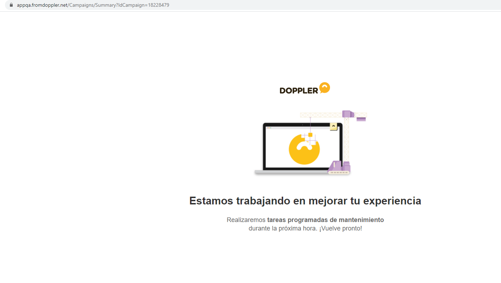

# Página de deploy

Por el momento la página de mantenimiento es un html estático, que se habilita o deshabilita manualmente mediante un archivo de configuración. El contenido de la página de deploy se puede ver [aquí](https://app.fromdoppler.com/offline).

Opciones de configuración disponibles:

- Habilitar o deshabilitar la página.
- Lenguaje, solo español por ahora.

## Escenarios posibles

### El usuario está logueado dentro de Doppler MVC al momento del deploy

El usuario se encuentra visualizando sus campañas en la sección Draft y se comienza con el deploy, hace click en otro link de `app2.fromdoppler.com` entonces va a aparecer la página offline de MVC estática, dejando la url actual sin cambiar. Cuando se haya terminado el deploy y **el usuario refresque la pantalla**, vuelve a la normalidad, aunque va a tener que volver a loguearse.



### El usuario quiere loguearse en Doppler durante el deploy

El usuario tiene abierta la página de login sin hacer nada, y se comienza el proceso de deploy. En un lapso entre 0 y 5 minutos va a aparecer la pantalla offline, o cuando el usuario intente loguearse. Luego de finalizado el deploy, se restablece la aplicación (en un tiempo entre 0 y 5 minutos), redirigiendo al login automáticamente.

### El usuario está logueado dentro de Doppler en una página de webapp al momento del deploy

Si un usuario está logueado en Doppler, dentro de una página de webapp: Reportes avanzados, Shopify, etc. (dominio `app.fromdoppler.com`) sucede lo mismo que en el punto anterior. Se visualiza la página offline, y en un lapso de 5 minutos intenta reconectar hasta que el deploy finalice, restableciendo la aplicación y redireccionando al login.

## Documentación técnica

Los archivos de configuración son dos, [uno para los ambientes de test](https://cdn.fromdoppler.com/webapp-status.json) (integration/QA) y [otro para producción](http://toggle.fromdoppler.com/webapp/webapp-status.json)).

El formato del archivo de configuración es el siguiente:

```json
{
  "status": {
    "offline": false
  }
}
```

 **Requisitos:** para que se tenga en cuenta el valor seteado en el archivo de configuración, se debe tener Doppler viejo offline (habilitando allí la página `app_offline.htm` en la raíz del proyecto `Doppler.Presentation.MVC`).

Para ver el detalle paso a paso como poner la aplicación en modo mantenimiento se puede seguir este [ejemplo en QA](https://www.screencast.com/t/FizkXB8kt0iJ).
